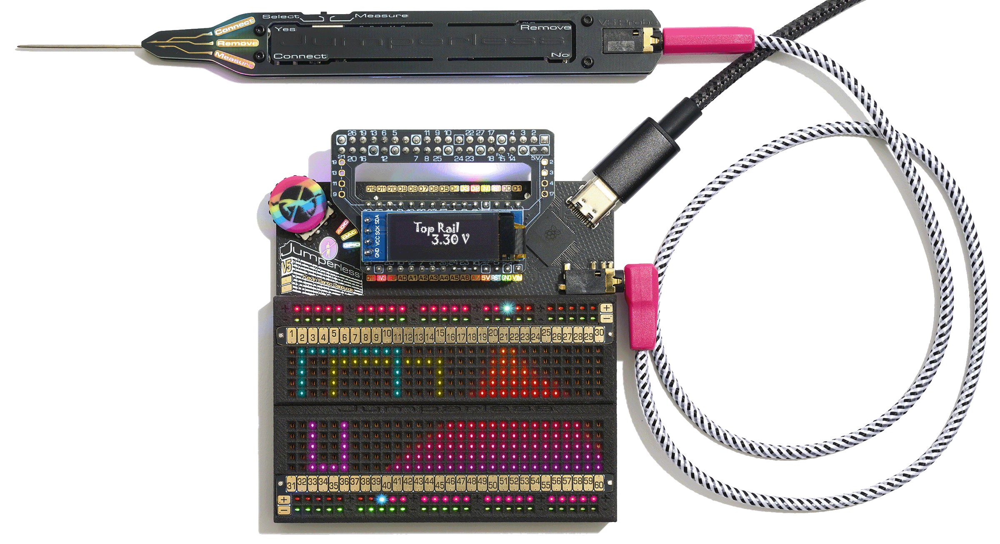
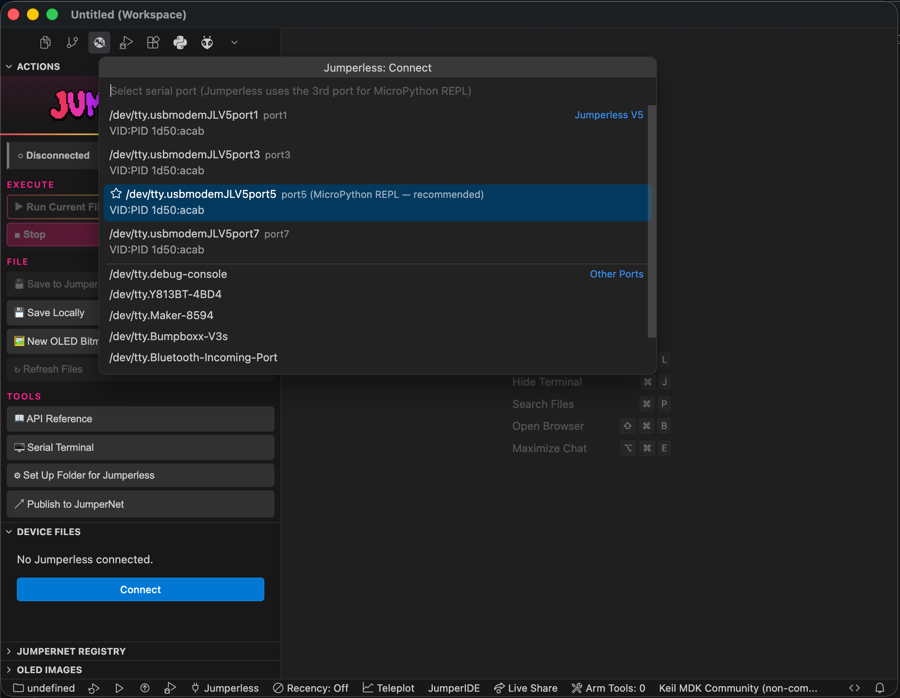
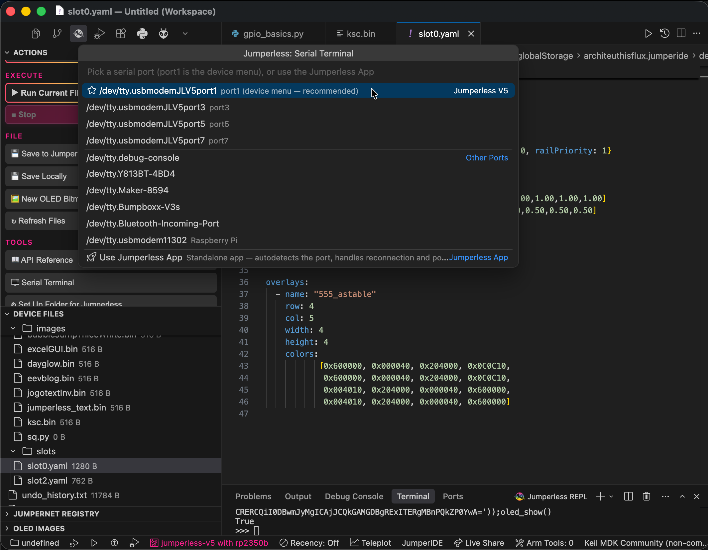
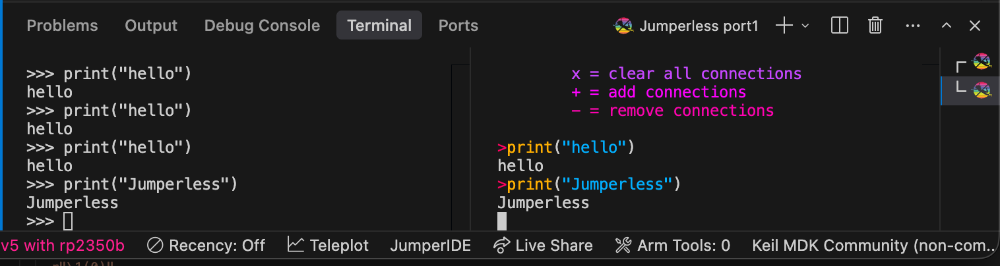
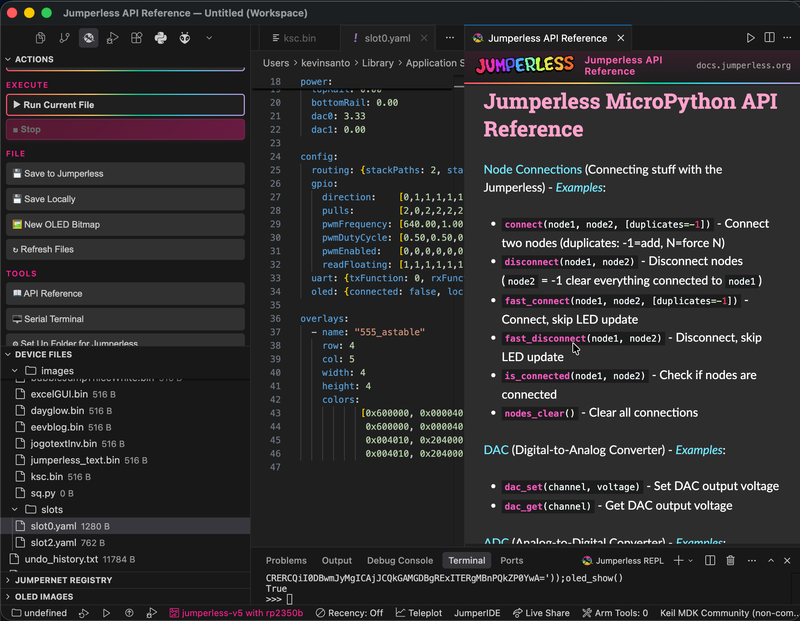
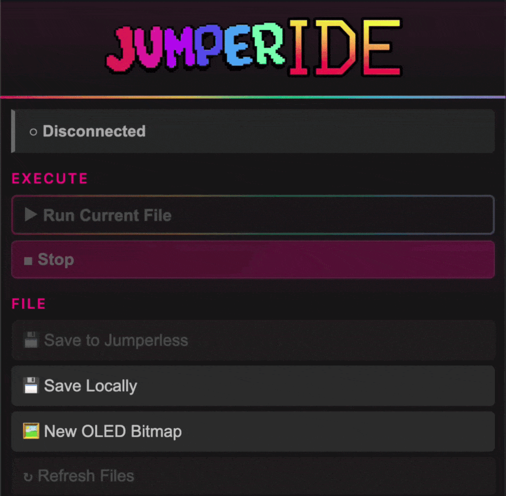

# JumperIDE for VS Code

**MicroPython IDE for the [Jumperless V5](https://shop.jumperless.org).**

[Docs](https://docs.jumperless.org) · [Web IDE](https://ide.jumperless.org) · [Shop](https://shop.jumperless.org)

## It's a breadboard, with no jumper wires.

[Jumperless V5](https://docs.jumperless.org) is a programmable breadboard that lets you connect any point to any other in software.

It has a MicroPython interpreter running on an RP2350B, four programmable ±8 V power supplies, a multimeter, oscilloscope, function generator, logic analyzer, and an RGB LED under every hole — all crammed inside a breadboard.

This extension is the VS Code version to the [web JumperIDE](https://ide.jumperless.org):

---

**Connect** — the board's serial ports are auto-detected by USB ID, with the MicroPython REPL port pre-selected:

**Serial terminal** — pick any port (port1 is the device menu), or hand the port to the standalone Jumperless App:

**REPL + device menu side by side** — the MicroPython REPL and the board's interactive menu, each on its own port:

**OLED bitmap editor** — draw pixels and watch them appear on the board's OLED live:

**API reference panel** — the full MicroPython API docs beside your code:

---

## Install

- **Cursor / VSCodium** — search **JumperIDE** in the Extensions view ([Open VSX](https://open-vsx.org/extension/ArchiteuthisFlux/jumperide)).
- **VS Code** — search **JumperIDE**, or download the `.vsix` from the [latest release](https://github.com/Architeuthis-Flux/JumperIDE-VSCode/releases/latest) (install command included in the release notes).

Plug in the board and click the connection button at the top of the Jumperless sidebar (or run **Jumperless: Connect** from the command palette, or click the plug icon in the status bar). No drivers needed.

## Features

**Actions panel** — everything in one sidebar panel: a connection button that doubles as live status (hover to connect or disconnect), **Run/Stop**, **Save to Jumperless**, **Save Locally** (export a device file to your computer), **OLED Bitmap**, the **Serial Terminal**, and quick access to the **API reference** and **JumperNet publishing**.

**Serial connection** — the V5 exposes four USB serial ports; the extension detects them by USB ID and pre-selects the MicroPython REPL port (the 3rd). Set `jumperless.connectOnStartup` to connect automatically.

**Run / Stop** — **Run** executes the file in the current editor on the board, output streams to the REPL terminal. **Stop** interrupts.

**Device file browser** — the board's filesystem in the sidebar. Files open as local working copies (so the language server works on them); saving pushes back to the board. Files that didn't come from the board ask for a device path on first save, then remember it. Create, delete, and upload files and folders.

**REPL terminal** — a terminal connected to the board's MicroPython prompt. Handles MicroPython line endings and batches output so fast prints don't stall the UI.

**Serial terminal** — pick any serial port (port1, the board's menu/CLI, is recommended) for a direct raw-passthrough terminal — the full-color menus and ANSI art render exactly as the board sends them. Or pick **Use Jumperless App** to run the standalone [Jumperless App](https://github.com/Architeuthis-Flux/Jumperless-App) instead (auto-installs from PyPI; autodetects the port and handles reconnection).

**Autocomplete & hover docs** — signatures and descriptions for every Jumperless function, sourced from the [API reference](https://docs.jumperless.org/09.5-micropythonAPIreference/) and refreshed automatically. Jumperless calls and constants are highlighted in Python files.

**OLED bitmap editor** — a pixel editor for OLED `.bin` files. While connected, edits push live to the board's OLED as you draw. **Jumperless: New OLED Bitmap** creates a blank 128×32 canvas on the device or locally.

**JumperNet registry** — browse community scripts and OLED images, open them, save them to the board, or publish your own (**Jumperless: Publish Script to Registry**). Feel free to publish whatever work in progress scripts, you or (anyone else) can update the same script and keep version history.

**API reference panel** — **Jumperless: Open API Reference** opens the [MicroPython API docs](https://docs.jumperless.org/09.5-micropythonAPIreference/) beside your code.

## Zero-import autocomplete

On the board, scripts run with the full API preloaded (`from jumperless import *` happens before your code). The editor matches that automatically: on first activation the extension installs typed stubs and points your Python analyzer at them, so files opened from the device resolve the whole API with no imports and no setup. (Controlled by `jumperless.setup.autoSetUpGlobally`, on by default.)

- `typings/jumperless.pyi` — typed stub, synced from [JumperlOS](https://github.com/Architeuthis-Flux/JumperlOS)
- `typings/builtins.pyi` — standard-library builtins with Jumperless globals layered on top (typo detection still works)
- `typings/time.pyi` — MicroPython `time` extras (`ticks_ms`, `sleep_ms`, …)

To get the same thing in one of your own project folders (checked into that repo instead of user settings), run **Jumperless: Set Up This Folder for Jumperless Python** — it writes the `typings/` folder and a `pyrightconfig.json` into the workspace.

Each piece is a toggle under Settings → Jumperless:

| Setting | Default | Effect |
|---------|---------|--------|
| `jumperless.setup.autoSetUpGlobally` | `true` | Global setup on first activation |
| `jumperless.setup.offerOnFirstOpen` | `true` | Offer per-workspace setup on first Python file |
| `jumperless.setup.jumperlessStub` | `true` | Write `typings/jumperless.pyi` |
| `jumperless.setup.globalRecognition` | `true` | Resolve the API with no imports (`builtins.pyi`) |
| `jumperless.setup.includeTimeStub` | `true` | Write the MicroPython `time` stub |
| `jumperless.setup.writeProjectConfig` | `true` | Write `pyrightconfig.json` / `.vscode/settings.json` |
| `jumperless.setup.recommendExtensions` | `true` | Offer to install Python + Pylance |

Set `globalRecognition` and `writeProjectConfig` to `false` to keep only the module stub and use `from jumperless import *` explicitly.

## Commands

| Command | Keybinding | Description |
|---------|-----------|-------------|
| Jumperless: Connect | | Pick a serial port and connect |
| Jumperless: Disconnect | | Disconnect |
| Jumperless: Run Current File | `F5` | Run the current editor on the device |
| Jumperless: Stop Execution | `Shift+F5` | Interrupt the running script |
| Jumperless: Save Current File to Jumperless | | Save the current editor onto the board (device files go back to their original path) |
| Jumperless: Save Current File Locally | | Save/export a copy of the current file to your computer |
| Jumperless: New File on Device | | Create a file on the board |
| Jumperless: New Folder on Device | | Create a folder on the board |
| Jumperless: Refresh Device Files | | Re-scan the device filesystem |
| Jumperless: Open API Reference | | Open the API docs in a panel |
| Jumperless: New OLED Bitmap | | Create a blank 128×32 OLED `.bin` and open the editor |
| Jumperless: Open Serial Terminal | | Pick a port for a direct serial terminal, or launch the Jumperless App |
| Jumperless: Open Jumperless App Terminal | | Run the [Jumperless App](https://github.com/Architeuthis-Flux/Jumperless-App) in a terminal (auto-installs from PyPI) |
| Jumperless: Set Up This Folder for Jumperless Python | | Optional: stubs + analyzer config in a workspace folder |
| Jumperless: Set Up Autocomplete Globally | | Re-run the automatic global setup |
| Jumperless: Publish Script to Registry | | Share your script on JumperNet |
| Jumperless: Show Activation Log | | Diagnostics |

## Settings

| Setting | Default | Description |
|---------|---------|-------------|
| `jumperless.serial.baud` | `115200` | Serial baud rate |
| `jumperless.serial.preferredPortIndex` | `2` | Which Jumperless port to pre-select (0-based; 2 = REPL) |
| `jumperless.connectOnStartup` | `false` | Connect automatically on activation |
| `jumperless.registry.baseUrl` | JumperNet | Registry server for community scripts/images |
| `jumperless.apiRef.refreshIntervalDays` | `7` | API reference refresh interval |
| `jumperless.terminal.convertEol` | `true` | Convert bare `\n` to `\r\n` in terminal output |
| `jumperless.terminal.debugIo` | `false` | Log terminal I/O for diagnosis |

Plus the `jumperless.setup.*` toggles above.

## Requirements

- VS Code 1.84+ (or recent Cursor / VSCodium)
- A [Jumperless V5](https://shop.jumperless.org) connected via USB
- Optional: Python + Pylance for full autocomplete and type checking

## Troubleshooting

- **No ports listed** — check that the USB cable carries data and the board is powered.
- **Connected but nothing works** — probably the wrong port; the REPL is the 3rd (marked "recommended" in the picker).
- **"Resource busy" opening a port** — something else has it open, usually the standalone Jumperless App. Quit it (Ctrl+Q) and retry.
- **Ctrl+Q in device menus** — works as expected in Jumperless terminals; the extension passes it through to the board instead of letting the editor shortcut fire.
- **Staircased terminal output** — make sure `jumperless.terminal.convertEol` is on.
- **Keystrokes not reaching the board** — enable `jumperless.terminal.debugIo` and check the "JumperIDE Terminal IO" output channel.
- **Anything else** — run **Jumperless: Show Activation Log** and [open an issue](https://github.com/Architeuthis-Flux/JumperIDE-VSCode/issues).

## For maintainers

Stub syncing and the release process

### Keeping the stub in sync

`stubs/jumperless.pyi` is the canonical typed stub from [JumperlOS](https://github.com/Architeuthis-Flux/JumperlOS) (`scripts/jumperless.pyi`). `npm run package` refreshes it automatically via `npm run sync-stubs`, which copies from a sibling `../JumperlOS` checkout (or `--from <path>` / `$JUMPERLESS_REPO`), falling back to GitHub raw. If no source is reachable it keeps the committed copy.

### Shipping a release

1. Add a `## [X.Y.Z]` section to `CHANGELOG.md` (optional but recommended).
2. Open **Actions → Release → Run workflow**, pick `patch` / `minor` / `major`.

The workflow bumps `package.json`, commits to `main`, creates tag `vX.Y.Z`, builds the `.vsix`, attaches it to a GitHub Release with install instructions, and publishes to the VS Marketplace / Open VSX when the `VSCE_PAT` / `OVSX_PAT` repo secrets are set.

To release a version you've already bumped locally: `git tag vX.Y.Z && git push origin vX.Y.Z` (tag must match `package.json`).

## Acknowledgments

Based on the [web JumperIDE](https://ide.jumperless.org) and [ViperIDE](https://github.com/vshymanskyy/ViperIDE). Autocomplete stubs are synced from [JumperlOS](https://github.com/Architeuthis-Flux/JumperlOS).

## License

[The Unlicense](https://github.com/Architeuthis-Flux/JumperIDE-VSCode/blob/main/LICENSE) — public domain.
